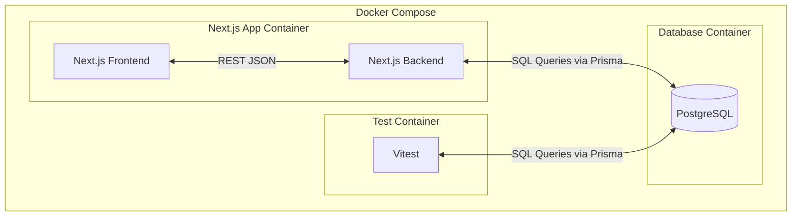

# Task Assignment Application

A web application for creating, assigning and managing development tasks, skill matching and developer assignment.

## Features

- Create tasks with recursive subtasks
- Skill detection via LLM based on task title
- View all existing tasks
- Assign tasks to developers based on skills
- Manage task status
- Task status validation (ie. Task can only be "Done" if subtasks are "Done")
- Fully Dockerised application

## Tech Stack

- Next.js, React, Node.js
- DaisyUI, TailwindCSS
- Prisma ORM with PostgreSQL
- Docker, Docker Compose
- Vitest

## Getting Started

### Pre-requisite

- Docker & Docker Compose installed

### Set up

1. Copy `.env.example` file to `.env`
   - `cp .env.example .env`
   - Add API key for `GEMINI_API_KEY`
2. Start database and app from Docker compose
   - `docker compose up database`
   - `docker compose up app --build`
3. Access the app at http://localhost:3000

### Run Tests

- `docker compose up test`

## System Architecture

## API Documentation

### Overview

The application exposes RESTful API endpoints built with **Next.js App Router** and **Prisma ORM**.  
All responses are returned in JSON format.

### Tasks API

#### `GET /api/tasks`

Fetch all tasks (including assigned developer and required skills).

#### `POST /api/tasks`

Create a new task with optional subtasks and skills.

#### `PATCH /api/tasks/[id]`

Update a task’s status or assigned developer.

### Developers API

#### `GET /api/developers`

Fetch all developers and their skills.

### Skills API

#### `GET /api/skills`

Returns all available skills.

## Design Justification

### System Architecture

- Full-stack architecture using Next.js App Router.
  - Keeps frontend and backend in one repository.
  - Reduces setup and deployment complexity.
  - Each route in `/app/api` corresponds to a REST endpoint.

- PostgreSQL + Prisma ORM
  - Chosen for strong relational modeling (many-to-many relationships between Tasks, Skills, Developers).
  - Prisma provides auto-generated TypeScript types, ensuring type-safe database operations.

### UI Design Justification

- **DaisyUI components** were used for consistent styling and light/dark theme support.
- **Dropdown-driven selection** for developers, skills and statuses provide a visual, interactive representation and ensure the UI always reflects actual database data.

### Testing Strategy

- **Unit tests** using Vitest for:
  - Recursive subtask logic
  - Developer and skill validation logic
- **Manual UI testing** in local environment for create/edit flows.